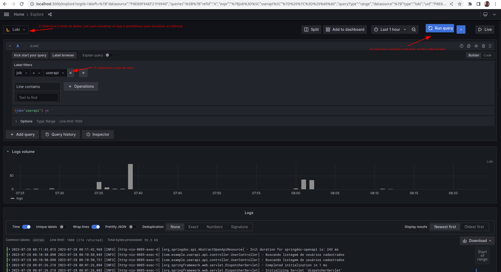
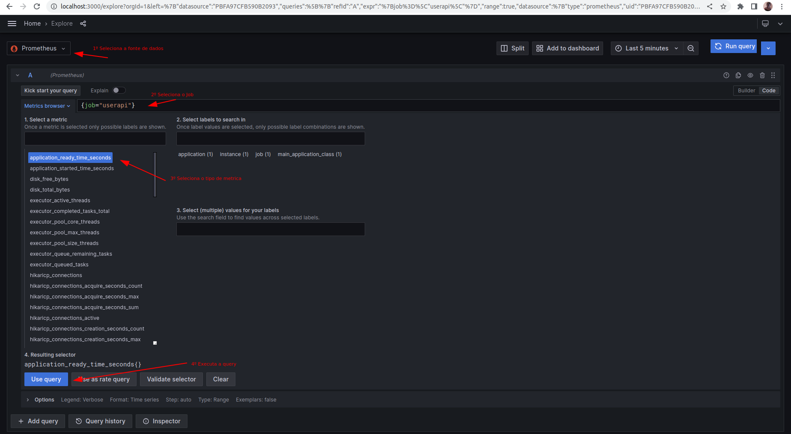

## User API
### Spring boot Rest Api + Swagger + MySQL + Docker + Grafana + Prometheus

User API é uma pequena Restful API que executas tarefas CRUD na entidade User por meio de Restful Webservices.

Ele expõe 6 endpoints conforme lista a seguir:

- GET /api/users (Obtem uma lista de usuários)
- POST /api/users (Cria um novo usuário)
- GET /api/users/1 (Obtem um usuário da lista por Id)
- PATCH /api/users/1 (Atualiza de forma parcial os dados de uma usuário)
- PUT /api/users/1 (Atualiza os dados de uma usuário)
- DELETE /api/users/1 (Delete um usuário por Id)

## Como configurar

User API é uma API baseada em docker. A execução do comando abaixo no diretório do projeto cria 5 contêineres em execução com dados iniciais registrados na base de dados:

- mysql-db: Para armazenamento das informações
- grafana: Para análise e visualização de dados
- loki: Para coleta, armazenamento e consulta de logs da api e do distema
- prometheus: Para coleta e armazenamento de métrias
- promtail: Agente responsável por coletar os logs 

```bash
docker compose up -d
```

OBS: A versão do docker compose é a V2 

## Como usar
Esta API é Restful e segue a especificação OpenAPI na documentação da API. Após rodar os containers, você pode acessar os links da aplicação como:
- Application Rest services : http://localhost:8085/api/users
- SwaggerUI : http://localhost:8085/api/swagger-ui.html


## Teste

Os testes foram desenvolvido utilizando o bando de dados H2 em memória


## Observabilidade e Monitoramento

- Prometheus: http://localhost:9090/targets
- Promtail: http://localhost:9080/targets
- Loki: http://localhost:3100/metrics
- Grafana: http://localhost:3000/explore

Ao acessar o Grafana é possível verificar os logs da aplicação e do sistema executando os seguintes passos:

**Para visualizar os logs:**
  


**Para visualizar as métricas**
